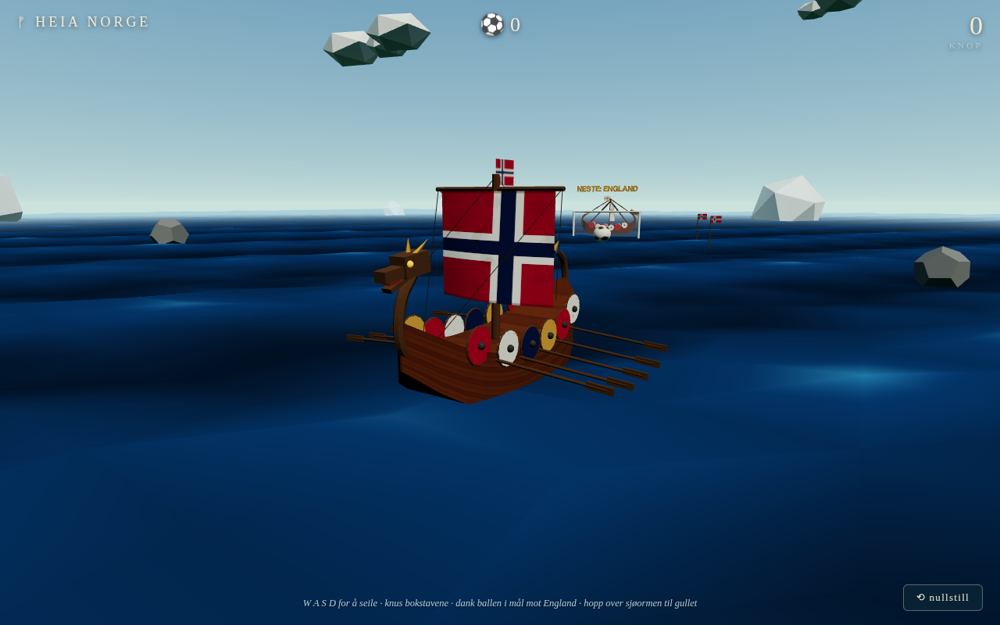
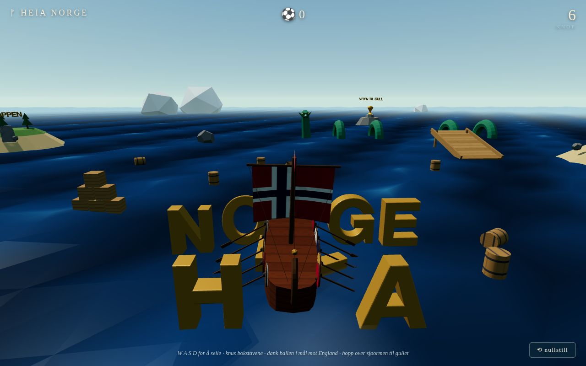

# ⚽ DRAKKAR — Norge seiler til VM-finalen

A tribute to [bruno-simon.com](https://bruno-simon.com) — the legendary drivable-car
portfolio — except the car is a **viking longship** flying the Norwegian flag, and the
theme is **Norway's road to the 2026 World Cup final**. Same idea underneath: a
raycast-vehicle physics rig you steer with WASD, a low-poly world full of things to
smash, and content zones you unlock by sailing up to them.



## Sail it

```bash
npm install
npm run dev
```

| Input | Action |
| --- | --- |
| `W A S D` / piltaster | seil & styr |
| `MELLOMROM` | kast anker (brems) |
| `R` | nullstill skipet |
| touch | styrespak nede til venstre |

Things to do out there:

- **Knus «HEIA NORGE»-bokstavene** — fysikkobjekter i gull, som hos Bruno.
- **Dank ballen i mål mot England-skipet** — måltavle og MÅÅÅL-feiring inkludert.
- **Seil innom sonene** — hver åpner et panel:
  - **VEIEN HIT** — alle Norge har slått i VM 2026 (flaggene deres henger slukøret i vannet):
    Irak 4–1, Senegal 3–2, Elfenbenskysten 2–1 og Brasil 2–1 (Haaland-dobbel!).
  - **NESTE: ENGLAND** — kvartfinalen: Hard Rock Stadium, Miami, lørdag 11. juli.
  - **TROPPEN** — alle 26 spillerne + Solbakkens støtteapparat.
  - **VEIEN TIL GULL** — mulige motstandere i semifinalen (Atlanta 15. juli) og
    finalen (MetLife 19. juli), voktet av selve gullpokalen.
- **Hopp over Jörmungandr** fra ramp — sjøormen ligger mellom deg og pokalen.



## How it works

- **No model files** — the entire ship (lofted hull, dragon figurehead, flag sail,
  shield row, rowing oars, steering oar) is built from three.js primitives in
  [`src/ShipModel.js`](src/ShipModel.js) — the England rival ship is the same model
  with a different `variant`.
- **It really is a car** — [`src/Ship.js`](src/Ship.js) runs a
  [cannon-es](https://github.com/pmndrs/cannon-es) `RaycastVehicle` with four invisible
  wheels on a flat, invisible plane, exactly like the original site's car.
- **The waves are a lie** — [`src/Ocean.js`](src/Ocean.js) defines one wave field used
  by both the water vertex shader and the JS that bobs/tilts the ship and props, so
  visuals stay in sync while physics stays flat.
- **Goal detection** lives in [`src/World.js`](src/World.js): the ball is a bouncy
  cannon sphere, and crossing the line behind the England goal bumps the scoreboard.

## Facts behind the theme (per 6. juli 2026)

Results and names are real, sourced from FIFA/UEFA/NRK-sphere coverage during the
tournament: Norway beat Iraq 4–1 and Senegal 3–2 (lost 1–4 to France) in Group I,
then Ivory Coast 2–1 in the round of 32 and Brazil 2–1 in the round of 16. The
quarter-final vs England is set for Hard Rock Stadium, Miami on 11 July; the winner
meets Argentina/Egypt/Switzerland/Colombia in Atlanta on 15 July, and the final at
MetLife Stadium on 19 July could bring France, Morocco, Portugal, Spain, USA or
Belgium. Squad and support staff as announced 21 May. Panel copy lives in
[`src/ui.js`](src/ui.js) — update it as the tournament unfolds. 🤞

## Dev

```bash
npm run dev       # vite dev server
npm run build     # production build to dist/
npm run preview   # serve the build on :4173
```

An end-to-end Playwright drive (renders headless, sails, steers, brakes, scores a
goal, jumps the ramp, opens the panels) lives in
[`scripts/e2e-drive.mjs`](scripts/e2e-drive.mjs) — see
[`.claude/skills/verify/SKILL.md`](.claude/skills/verify/SKILL.md) for how to run it.
